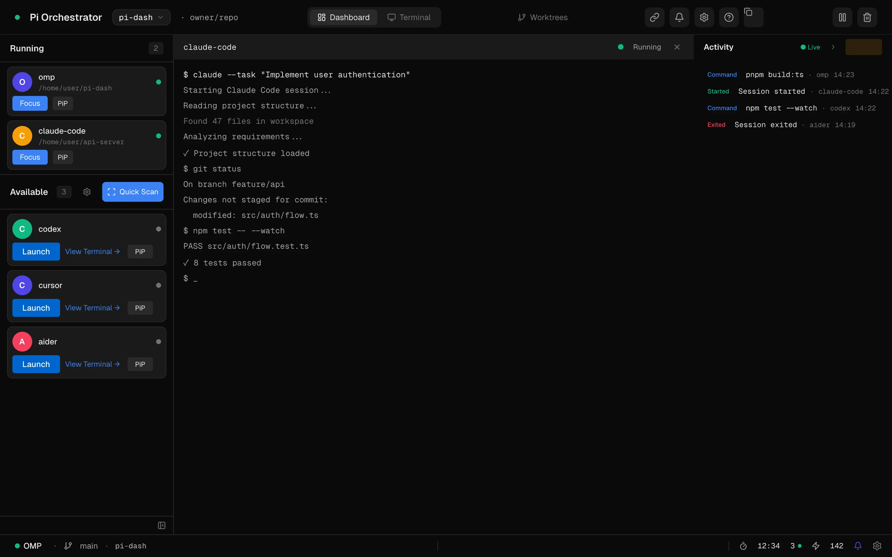
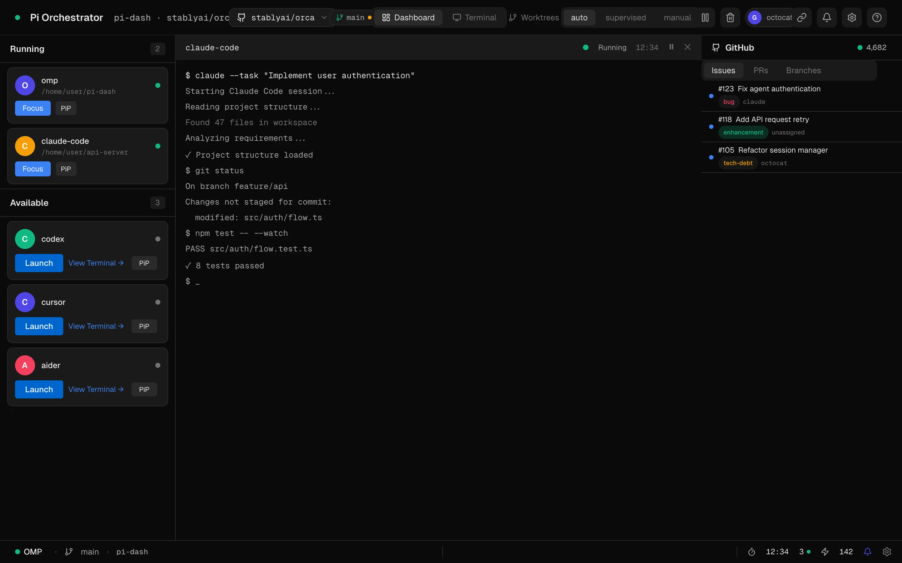
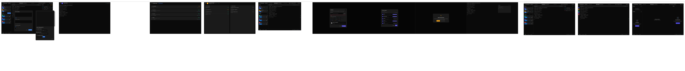
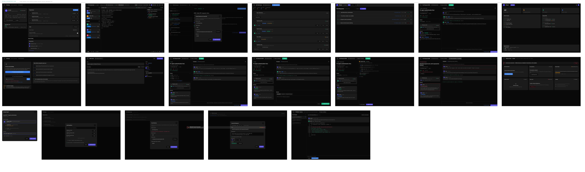
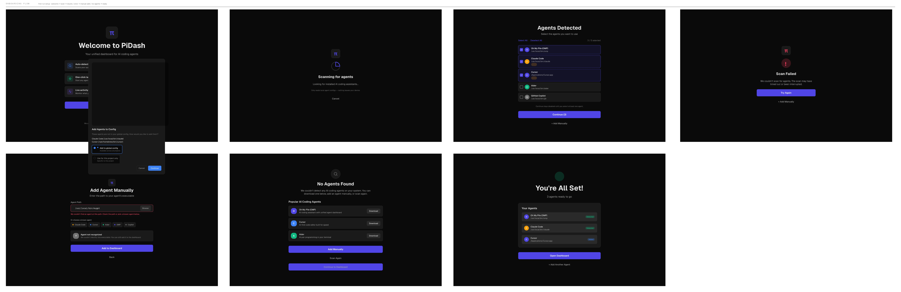

# PiDash

<div align="center">

**A desktop dashboard for monitoring and managing your fleet of AI coding agents**

[](https://opensource.org/licenses/MIT)
[](https://www.typescriptlang.org/)
[](https://reactjs.org/)
[](https://www.electronjs.org/)

[Features](#features) • [Getting Started](#getting-started) • [Screenshots](#screenshots) • [Contributing](#contributing) • [License](#license)

</div>

## Features

- **Multi-agent dashboard** — track status, tasks, and resource usage for all your AI agents in one place
- **Auto-detection** — scans your system for installed agents (Cursor, OMP, Claude Code, and more), or add them manually
- **Live terminal sessions** — real-time PTY streams from every agent via xterm.js; watch, intervene, or let them run
- **GitHub integration** — OAuth or PAT auth; browse issues, PRs, and branches; create PRs and submit reviews directly
- **File explorer** — browse project files, preview content, see git status, copy paths, and reveal in your file manager
- **Worktree management** — create and manage git worktrees with configurable branch naming patterns
- **Command palette** — fuzzy search across agents, projects, and actions (`Ctrl+K` / `Cmd+K`)
- **Picture-in-Picture** — floating terminal overlays so you can watch an agent while working elsewhere
- **Smart notifications** — alerts for agent start/complete/error, PR reviews, and issue assignments
- **Agent drift detection** — background scans detect new, missing, or moved agents and prompt you to review
- **Keyboard shortcuts** — fully customizable bindings for navigation, agent control, and app commands
- **Settings** — theme (dark/light/system), terminal config, notification preferences, worktree paths, and more
- **Reset & recovery** — export/import your full config, or reset agents, projects, or everything

## Screenshots

| Dashboard | GitHub Integration |
|-----------|-------------------|
|  |  |

## Design

The UI is designed in [Pencil](https://pencil.design/) and exported as design sheets showing complete user flows:

<details>
<summary><strong>Main App Flow</strong> — Dashboard, agents, terminal sessions, and activity feed</summary>



</details>

<details>
<summary><strong>GitHub Integration</strong> — Issues, PRs, branches, and authentication</summary>



</details>

<details>
<summary><strong>Onboarding Flow</strong> — Agent detection, project setup, and initial configuration</summary>



</details>

## Tech Stack

| Layer | Technology |
|-------|-----------|
| Runtime | Electron |
| UI | React 19, React Router, Radix UI, shadcn/ui |
| Styling | Tailwind CSS |
| Terminal | xterm.js + node-pty |
| GitHub | Octokit REST, local OAuth server |
| Build | Vite, TypeScript, electron-builder |
| Testing | Vitest, Testing Library |
| Landing page | Astro 5, Tailwind CSS v4 |

## Getting Started

### Prerequisites

- Node.js 18+
- pnpm

### Install & Run

```bash
# Install dependencies
pnpm install

# Start dev server (TypeScript watch + Vite + Electron)
pnpm dev

# Run tests
pnpm test

# Type check
npx tsc --noEmit

# Production build (all platforms)
pnpm build

# Platform-specific builds
pnpm build:win
pnpm build:mac
pnpm build:linux
```

Build output lands in `release/`.

### First Launch

1. **Onboarding** — PiDash scans your system for AI coding agents. Select the ones you use, or add them manually.
2. **Project setup** — Add your project directories or clone a repo. PiDash scopes agents to their relevant projects.
3. **Dashboard** — See all your agents, their sessions, and activity in one view.

## Project Structure

```
pi-dash/
├── src/
│   ├── main.ts              # Electron entry point
│   ├── preload.ts           # IPC bridge (contextBridge)
│   ├── main/                # Main process modules
│   │   ├── github/          # GitHub auth, services, polling
│   │   ├── ipc/             # IPC handlers (sessions, filetree, search, settings, worktrees)
│   │   ├── agent/           # Agent-git bridge
│   │   ├── session/         # PTY session management
│   │   ├── worktree/        # Git worktree service
│   │   ├── keyboard/        # Keyboard shortcut manager
│   │   ├── notifications/   # Desktop notification manager
│   │   └── settings/        # Settings service and defaults
│   └── shared/              # Types shared between main and renderer
├── renderer/
│   └── src/
│       ├── App.tsx           # Router and top-level layout
│       ├── components/
│       │   ├── dashboard/    # Dashboard, file tree, terminal, activity feed
│       │   ├── github/       # GitHub UI (issues, PRs, branches, auth)
│       │   ├── settings/     # Settings screens
│       │   ├── onboarding/   # Agent detection onboarding flow
│       │   ├── project-setup/# Project setup flow
│       │   ├── pip/          # Picture-in-picture overlays
│       │   ├── views/        # Agent detail, worktree, completed work views
│       │   └── ui/           # shadcn/ui primitives
│       ├── hooks/            # React hooks
│       ├── context/          # React context providers
│       └── types/            # Renderer type definitions
├── landing/                  # Astro marketing site (waitlist, features, screenshots)
├── docs/superpowers/         # Design specs and implementation plans
└── design/                   # Pencil design files
```

## Architecture

- **Main process** handles IPC, agent scanning, PTY sessions, git operations, GitHub API calls, file system access, settings persistence, and keyboard shortcuts.
- **Preload** exposes a typed `window.api` bridge via `contextBridge` — the renderer never touches Node APIs directly.
- **Renderer** is a React SPA routed with React Router. State flows through context providers (Session, GitHub, Settings, PiP).
- **Landing page** is a standalone Astro site in `landing/`, deployed separately from the Electron app.

## Troubleshooting

| Issue | Fix |
|-------|-----|
| Onboarding won't start | Delete `agents.json` or set `onboardingCompleted: false` in it |
| "window.api is undefined" | Ensure preload script is loaded; check `contextIsolation` in Electron config |
| Scan finds no agents | Verify agents are in standard locations; use Manual Add for custom paths |
| GitHub auth fails | Check that your PAT has the required scopes, or retry OAuth flow |
| Build fails | Run `pnpm install` to ensure all deps are present, then retry |
| node-pty rebuild fails | Ensure Python and a C++ compiler are available for `electron-rebuild` |

## Roadmap

- [ ] Plugin system for custom agent integrations
- [ ] Enhanced analytics and metrics dashboard
- [ ] Cross-agent collaboration features
- [ ] Cloud sync for settings and configurations
- [ ] Mobile companion app

## Contributing

Contributions are welcome! Please read our [Contributing Guide](CONTRIBUTING.md) for details on our code of conduct and the process for submitting pull requests.

## License

This project is licensed under the MIT License — see the [LICENSE](LICENSE) file for details.

## Acknowledgments

- Built with [Electron](https://www.electronjs.org/), [React](https://reactjs.org/), and [TypeScript](https://www.typescriptlang.org/)
- UI components from [shadcn/ui](https://ui.shadcn.com/) and [Radix UI](https://www.radix-ui.com/)
- Terminal emulation powered by [xterm.js](https://xtermjs.org/)
- GitHub integration via [Octokit](https://octokit.github.io/)

---

<div align="center">

Made for the AI-assisted development community

</div>
