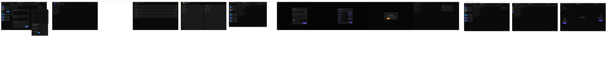
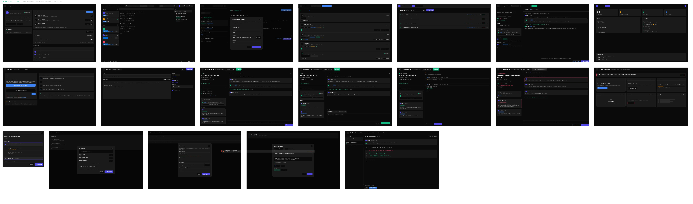
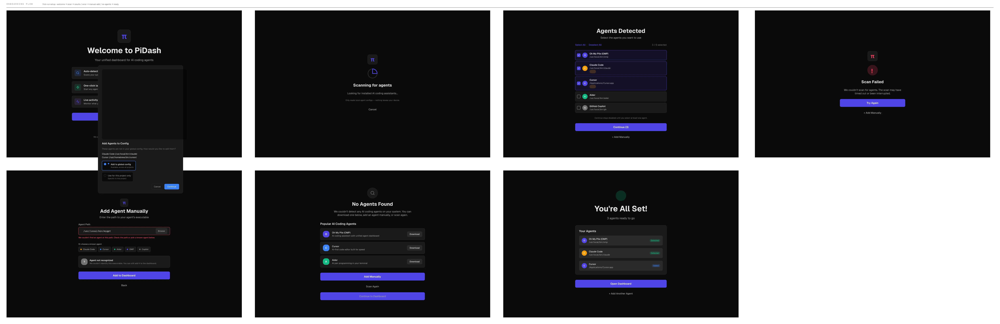
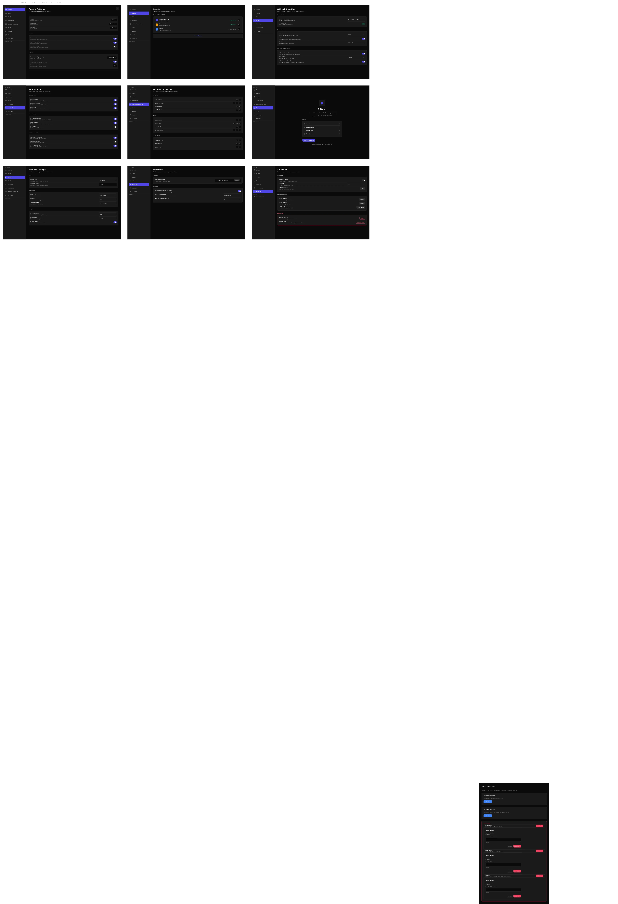
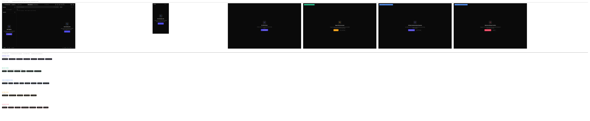
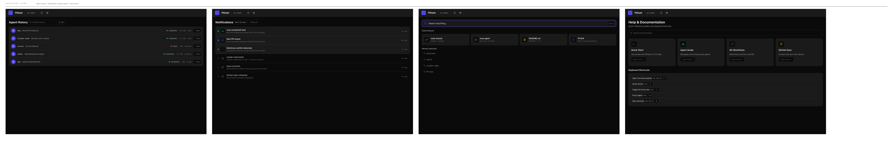

# PiDash Design

The UI is designed in [Pencil](https://pencil.design/) and exported as design sheets showing complete user flows.

## Main App Flow

Dashboard, agents, terminal sessions, and activity feed.

## GitHub Integration

Issues, PRs, branches, and authentication.

## Onboarding Flow

Agent detection, project setup, and initial configuration.

## Settings Flow

Theme, terminal config, notifications, and preferences.

## States Flow

Agent states, loading, empty, and error states.

## Auxiliary Flow

Dialogs, modals, and secondary interactions.

